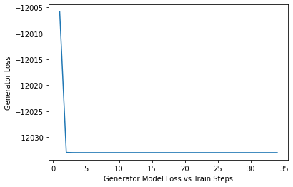
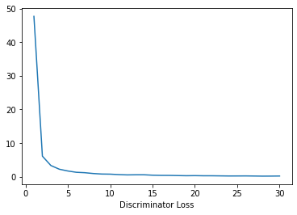

# SeqMed: Recommending Medication Combination with Sequence Generative Adversarial Nets
CS598 Re-implementation study examining the SeqMed architecture proposed in https://ieeexplore.ieee.org/document/9313196

### Citation: 
S. Wang, "SeqMed: Recommending Medication Combination with Sequence Generative Adversarial Nets," 2020 IEEE International Conference on Bioinformatics and Biomedicine (BIBM), 2020, pp. 2664-2671, doi: 10.1109/BIBM49941.2020.9313196.

### Reference:
Author of SeqMed does not have public repository for SeqMed.

All work for implementation of SeqMed followed the following repo for reference
https://github.com/suragnair/seqGAN

### Dependencies:
- dill==0.3.4
- torch==1.11.0+cu113

### Data Download Instruction:
As per professor consent, pre-processed MIMIC-III data is used from the data found in data_final.pkl at https://github.com/sjy1203/GAMENet/tree/master/data

### Training Code + Command:
```console
python main.py
```
### Results:
Failed to successfully recreate study.


